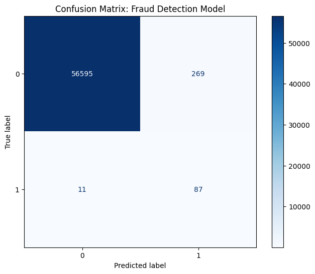
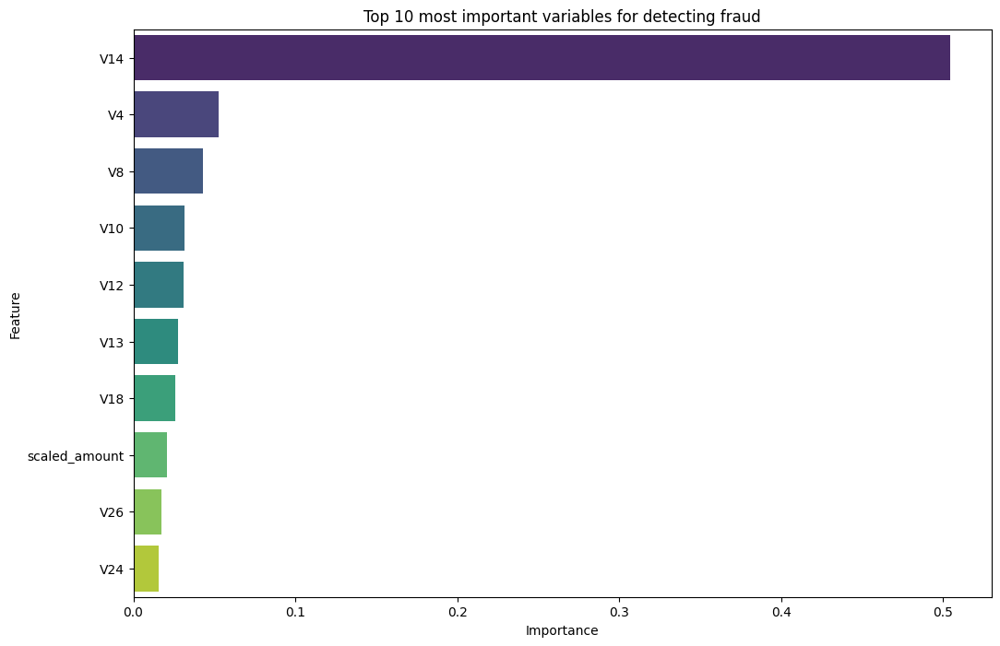

# Credit Card Fraud Detection Pipeline

## Project Overview
This project implements a near real-time bank fraud detection system. The primary challenge is the **extreme class imbalance**, with fraudulent transactions accounting for only **0.172%** of the dataset.

The goal is to minimize financial losses by maximizing **Recall** (detection rate) while maintaining a reasonable precision to ensure a smooth customer experience (minimizing False Positives).

## Tech Stack
* **Language:** Python
* **Modeling:** XGBoost (Gradient Boosting)
* **Imbalance Handling:** SMOTE (Synthetic Minority Over-sampling Technique)
* **Data Engineering:** Pandas, Scikit-Learn (RobustScaler)
* **Visualization:** Seaborn, Matplotlib

## Methodology & Pipeline

### 1. Dynamic Data Acquisition
The project utilizes the `kagglehub` library to ensure reproducibility. The dataset is automatically downloaded via the official Kaggle API.

### 2. Preprocessing
* **Robust Scaling:** The `Time` and `Amount` columns were normalized using `RobustScaler`. This is a critical choice as it uses the median and the interquartile range, making it resilient to **outliers**—which are common in fraud data.
* **Stratified Splitting:** Train/Test split was performed with stratification to preserve the 0.17% fraud ratio in both sets.

### 3. Handling Imbalance (SMOTE)
To enable the algorithm to learn fraud patterns despite the scarcity of examples, I applied **SMOTE** exclusively to the training set. This generates synthetic fraud examples through spatial interpolation.

---

## Results and Analysis

### Confusion Matrix
 

**Interpretation:**
* **89% Recall:** The model successfully captures the vast majority of frauds (87 out of 98 in the test set).
* **Risk Management:** The model accepts a moderate number of false positives (269) to ensure that no major fraud goes undetected.

### Feature Importance (Top 10)

**Business Insight:** Analysis reveals that variable **V14** is the strongest predictor (50% importance). In a real-world scenario, this allows fraud investigators to know which behavioral indicators to prioritize.

### Performance Report
| Metric | Class 1 (Fraud) |
| :--- | :--- |
| **Precision** | 0.24 |
| **Recall** | **0.89** |
| **F1-Score** | 0.38 |

---

## Future Improvements
* Hyperparameter optimization using `RandomizedSearchCV`.
* Testing unsupervised anomaly detection algorithms (e.g., Isolation Forest).
* Deploying a prediction API using FastAPI and Docker.

---
*Project developed as part of a personal Data Science portfolio (2025).*
